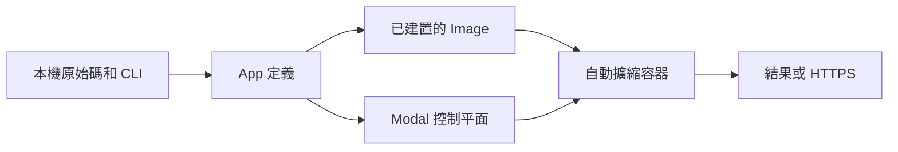

# Modal

Modal 在受管理的自動擴縮容器中執行 Python 函式。當維運叢集帶來的工作量大於價值時，可將其用於平行批次處理、機器學習訓練或推論、排程作業和 HTTP 服務。對於小型本機作業、需要主機層級控制的工作負載，或現有基礎架構已能妥善支援的系統，Modal 較不適合。

## 執行模型

Modal 程式使用 Python 宣告應用程式及其容器需求。CLI 將該定義傳送至 Modal；Modal 建置 Image，並在 Function 收到工作時啟動容器。各 Function 獨立擴縮，閒置時通常縮減至零。



大多數應用程式只需要以下四類物件：

- **App** 將 Function 和容器類別組合成一次暫時執行或一次不可分割的部署。
- **Function** 是遠端執行單元，擁有獨立的資源和擴縮行為。
- **Image** 定義容器中可用的 Python 版本、套件、系統相依項目和檔案。
- **容器類別** 將共用容器初始化程序和狀態的遠端方法組合在一起。

Volume 提供持久化檔案，Secret 則將敏感設定注入容器，而無需寫入原始碼。

:::caution[本機匯入與遠端匯入]
Modal 可能在本機和遠端容器內匯入同一個模組。不要在模組範圍無條件讀取只存在於本機的檔案；應將資料作為引數傳入、把檔案加入 Image，或使用 [`modal.is_local()`](https://modal.com/docs/guide/global-variables)。
:::

## 執行平行 CPU 工作負載

建立 `modal_primes.py`。以下完整範例先進行一次阻塞式遠端呼叫，再使用 `.map()` 分派互相獨立的輸入：

```python title="modal_primes.py"
from math import isqrt

import modal

app = modal.App("modal-primes")
image = modal.Image.debian_slim(python_version="3.12")


@app.function(image=image, cpu=1)
def count_primes(limit: int) -> int:
    def is_prime(number: int) -> bool:
        if number < 2:
            return False
        return all(number % divisor for divisor in range(2, isqrt(number) + 1))

    return sum(is_prime(number) for number in range(limit))


@app.local_entrypoint()
def main():
    print(count_primes.remote(100_000))

    limits = [100_000, 110_000, 120_000]
    print(list(count_primes.map(limits)))
```

安裝用戶端、完成驗證並執行應用程式：

```bash
pip install modal
modal setup
modal run modal_primes.py
```

本機進入點在本機電腦上執行。`.remote()` 等待一個遠端結果，`.map()` 則平行處理輸入，並依輸入順序產生結果。

## 核心功能

### GPU

為 Function 或容器類別要求受支援的 GPU。將支援 GPU 的程式庫（例如啟用 CUDA 的 PyTorch）加入其 Image；要求 GPU 只會提供硬體，不會安裝使用該硬體的軟體。

```python
@app.function(image=image, gpu="L4")
def train():
    run_training()
```

`gpu="L4"` 會為服務此 Function 的每個作用中容器提供一張 L4 GPU。Modal 可能在多次呼叫之間重用暖容器；如果 Function 向外擴展，每個新增容器都會獲得獨立的 GPU。應根據實測的記憶體和輸送量需求選擇 GPU，而不是只看標稱規格。

### 容器類別生命週期

當每個容器都需要只初始化一次高成本狀態，並在多次呼叫之間重用該狀態時，使用容器類別。

```python
@app.cls(gpu="L4")
class Model:
    @modal.enter()
    def load(self):
        self.model = load_model()

    @modal.method()
    def predict(self, prompt):
        return self.model.generate(prompt)
```

呼叫 `Model().predict.remote(prompt)` 會啟動或重用由 L4 支援的容器。
每個新容器啟動時，`load()` 執行一次；該容器處理的後續呼叫會重用已載入的模型。

### Web Function

使用 Web 裝飾器透過 HTTPS 公開 Function。`modal serve` 建立開發 URL；`modal deploy` 建立持久部署。

```python
web_image = image.uv_pip_install("fastapi[standard]")


@app.function(image=web_image)
@modal.fastapi_endpoint(requires_proxy_auth=True)
def health():
    return {"status": "ok"}
```

`requires_proxy_auth=True` 使用 Modal Proxy Token 保護端點。未設定 Proxy 或應用程式驗證時，Web Function 可供公開存取。

### 排程

為 Function 附加排程，並部署 App 以啟用該排程。

```python
@app.function(schedule=modal.Cron("0 8 * * 1", timezone="Asia/Shanghai"))
def weekly_refresh():
    print("Refresh the index")
```

使用 `modal.Cron` 設定依牆上時鐘執行的排程，使用 `modal.Period` 設定從部署時刻起計算的時間間隔。

## 維運注意事項

- 遠端引數、結果和例外會跨越序列化邊界。傳遞儲存空間參照，不要傳遞大型承載資料。
- 冷啟動時間取決於 Image 大小、初始化程序和硬體可用性。保持 Image 和啟動工作精簡。
- 容器本機檔案是暫時的，可變程序狀態可能在多次呼叫之間保留。將必要狀態持久化至外部儲存空間。
- 為容易失敗的工作設定逾時和重試，並保護所有非刻意公開的 Web Function。
- 運算和儲存空間均按用量計費。在選擇資源或暖容器前，查看 [Modal 定價](https://modal.com/pricing)。

## 延伸閱讀

- [App、Function 和進入點](https://modal.com/docs/guide/apps)
- [Image](https://modal.com/docs/guide/images)
- [GPU 加速](https://modal.com/docs/guide/gpu)
- [Web Function](https://modal.com/docs/guide/webhooks)
- [Volume](https://modal.com/docs/guide/volumes)
