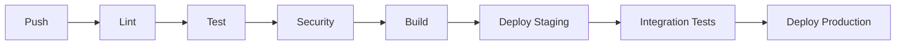

# Python Engineering Guide: Modern Development Practices

## Table of Contents
1. [Introduction to Python Engineering](#introduction-to-python-engineering)
2. [Project Setup and Configuration](#project-setup-and-configuration)
3. [Development Environment Management](#development-environment-management)
4. [Code Quality and Standards](#code-quality-and-standards)
5. [Testing and Quality Assurance](#testing-and-quality-assurance)
6. [Dependency Management](#dependency-management)
7. [Continuous Integration and Deployment](#continuous-integration-and-deployment)
8. [Documentation and Maintenance](#documentation-and-maintenance)
9. [Performance and Optimization](#performance-and-optimization)
10. [Security Best Practices](#security-best-practices)

---

## Introduction to Python Engineering

### What is Python Engineering?

Python Engineering encompasses the systematic approach to developing, deploying, and maintaining Python applications using modern tools, practices, and methodologies. It goes beyond just writing Python code to include the entire software development lifecycle, from project initialization to production deployment and long-term maintenance.

### Core Principles

| Principle | Description | Why It Matters |
|-----------|-------------|----------------|
| **Automation** | Automate repetitive tasks and processes | Reduces human error, increases efficiency |
| **Consistency** | Use standardized tools and workflows | Improves team collaboration and code quality |
| **Reproducibility** | Ensure builds and environments are consistent | Enables reliable deployment and debugging |
| **Scalability** | Design for growth and maintenance | Future-proofs your codebase |
| **Security** | Implement security practices from the start | Prevents vulnerabilities and data breaches |

### Engineering vs. Scripting

| Aspect | Scripting | Engineering |
|--------|-----------|-------------|
| **Scope** | Single-purpose, small scale | Complex systems, large scale |
| **Structure** | Simple, linear | Modular, organized |
| **Testing** | Minimal or none | Comprehensive test suites |
| **Dependencies** | Manual, ad-hoc | Managed, versioned |
| **Deployment** | Manual execution | Automated pipelines |
| **Maintenance** | Reactive | Proactive |

---

## Project Setup and Configuration

### Modern Project Structure

A well-structured Python project follows established conventions:

```
project-name/
├── .gitignore              # Git ignore patterns
├── .python-version          # Python version specification
├── pyproject.toml          # Project configuration (🔑 See dedicated guide)
├── uv.lock                 # Universal lockfile (commit to VCS)
├── README.md               # Project documentation
├── CHANGELOG.md            # Version history
├── src/                    # Source code (recommended layout)
│   └── project_name/
│       ├── __init__.py
│       ├── main.py
│       └── modules/
├── tests/                  # Test files
│   ├── __init__.py
│   ├── test_main.py
│   └── conftest.py
├── docs/                   # Documentation source
│   ├── conf.py
│   └── index.md
├── scripts/                # Utility scripts
├── .github/                # CI/CD workflows
│   └── workflows/
└── requirements/           # Legacy requirements (if needed)
    ├── base.txt
    └── dev.txt
```

### Configuration Files Overview

| File | Purpose | Management |
|------|---------|------------|
| **pyproject.toml** | 🎯 **Central configuration file** | [Complete Guide →](pyproject-guide-en.md) |
| **requirements.txt** | Legacy dependency list | Use `uv pip compile` to generate |
| **Pipfile/Poetry.lock** | Alternative lockfiles | Migrate to uv.lock |
| **setup.py/setup.cfg** | Legacy build scripts | Migrate to pyproject.toml |
| **tox.ini** | Testing configuration | Move to pyproject.toml |

### Essential Project Metadata

```toml
[project]
name = "your-project"
version = "1.0.0"
description = "Brief description of your project"
readme = "README.md"
license = {text = "MIT"}
authors = [
    {name = "Your Name", email = "your.email@example.com"}
]
maintainers = [
    {name = "Maintainer Name", email = "maintainer@example.com"}
]
classifiers = [
    "Development Status :: 4 - Beta",
    "Intended Audience :: Developers",
    "License :: OSI Approved :: MIT License",
    "Programming Language :: Python :: 3",
    "Programming Language :: Python :: 3.8",
    "Programming Language :: Python :: 3.9",
    "Programming Language :: Python :: 3.10",
    "Programming Language :: Python :: 3.11",
    "Programming Language :: Python :: 3.12",
]
keywords = ["python", "engineering", "best-practices"]
requires-python = ">=3.8"
```

> **📖 Deep Dive**: For comprehensive pyproject.toml configuration, see our [Complete Guide to pyproject.toml](pyproject-guide-en.md)

---

## Development Environment Management

### Python Version Management

| Tool | Approach | Recommendation |
|------|----------|----------------|
| **uv python** | Integrated with uv | ✅ **Recommended** |
| **pyenv** | Standalone version manager | ✅ Good alternative |
| **system Python** | OS-managed versions | ⚠️ Not recommended for development |
| **conda** | Environment + version manager | ✅ Good for data science |

#### uv Python Management Examples

```bash
# Install Python versions
uv python install 3.11 3.12

# List available versions
uv python list

# Pin Python for project
uv python pin 3.11

# Create environment with specific version
uv venv --python 3.11
```

### Virtual Environment Strategies

| Strategy | Command | Use Case |
|----------|----------|----------|
| **Auto-managed** | `uv run script.py` | ✅ **Recommended** for daily development |
| **Explicit venv** | `uv venv && source .venv/bin/activate` | Traditional workflow |
| **Multiple envs** | `uv venv .venv-dev`, `uv venv .venv-test` | Isolated environments |
| **Container-based** | Docker with uv | Production/deployment |

### Environment Isolation Best Practices

1. **Never use system Python for development**
2. **Commit `.python-version` to version control**
3. **Use environment-specific dependency groups**
4. **Automate environment setup in CI/CD**
5. **Document environment requirements clearly**

> **📖 Deep Dive**: For comprehensive uv usage and management, see our [Complete Guide to uv](uv-guide-en.md)

---

## Code Quality and Standards

### The Modern Code Quality Stack

| Category | Modern Tool | Traditional Alternatives | Why Modern? |
|----------|-------------|------------------------|-------------|
| **Linting** | Ruff | Pylint, Flake8 | 10-100x faster, comprehensive rules |
| **Formatting** | Ruff Format | Black, autopep8 | Unified with linter, fast |
| **Type Checking** | MyPy | None required | Static type verification |
| **Import Sorting** | Ruff | isort | Built into Ruff |
| **Security** | Ruff (bandit rules) | bandit, safety | Integrated, faster |

### Code Quality Implementation

#### Complete Configuration in pyproject.toml

```toml
[tool.ruff]
line-length = 88
target-version = "py38"

[tool.ruff.lint]
# Select rules from multiple categories
select = [
    "E",      # pycodestyle errors
    "F",      # pyflakes
    "W",      # pycodestyle warnings
    "I",      # isort
    "N",      # pep8-naming
    "B",      # flake8-bugbear
    "C90",    # mccabe
    "UP",     # pyupgrade
    "S",      # flake8-bandit (security)
]

ignore = [
    "E501",   # line too long (handled by formatter)
    "B008",   # do not perform function calls in argument defaults
]

[tool.ruff.lint.per-file-ignores]
"__init__.py" = ["F401"]  # unused imports
"tests/*" = ["S101"]       # assert usage in tests

[tool.ruff.format]
quote-style = "double"
indent-style = "space"
line-ending = "auto"

[tool.mypy]
python_version = "3.8"
warn_return_any = true
warn_unused_configs = true
disallow_untyped_defs = true
```

### Pre-commit Hooks Integration

```yaml
# .pre-commit-config.yaml
repos:
  - repo: https://github.com/astral-sh/ruff-pre-commit
    rev: v0.1.0
    hooks:
      - id: ruff
        args: [--fix]
      - id: ruff-format

  - repo: https://github.com/pre-commit/mirrors-mypy
    rev: v1.0.0
    hooks:
      - id: mypy
        additional_dependencies: [types-requests]
```

### Quality Gates in CI/CD

```yaml
# GitHub Actions
- name: Code Quality Checks
  run: |
    uv run ruff check src/
    uv run ruff format --check src/
    uv run mypy src/
    uv run pytest --cov=src --cov-fail-under=80
```

> **📖 Deep Dive**: For detailed comparison of code quality tools, see our [Introduction to Python Code Quality Tools](python-tools-introduction-en.md)

---

## Testing and Quality Assurance

### Testing Pyramid

| Level | Purpose | Tools | Coverage Goal |
|-------|---------|-------|---------------|
| **Unit Tests** | Test individual functions/methods | pytest, unittest | 80-90%+ |
| **Integration Tests** | Test component interactions | pytest, testcontainers | 60-70% |
| **End-to-End Tests** | Test complete workflows | playwright, selenium | 20-30% |
| **Performance Tests** | Benchmark critical paths | pytest-benchmark, locust | Key metrics |

### Modern Testing Configuration

#### pytest Configuration (pyproject.toml)

```toml
[tool.pytest.ini_options]
minversion = "7.0"
addopts = [
    "-ra",                    # show extra test summary info
    "-q",                     # quiet mode
    "--strict-markers",       # strict marker validation
    "--strict-config",        # strict config validation
    "--cov=src",              # coverage measurement
    "--cov-report=term-missing",
    "--cov-report=html",
    "--cov-report=xml",
    "--cov-fail-under=80",    # require 80% coverage
]
testpaths = ["tests"]
python_files = ["test_*.py", "*_test.py"]
python_classes = ["Test*"]
python_functions = ["test_*"]

markers = [
    "slow: marks tests as slow (deselect with '-m \"not slow\"')",
    "integration: marks tests as integration tests",
    "unit: marks tests as unit tests",
    "network: marks tests that require network access",
    "flaky: marks tests that are known to be flaky",
]
```

#### Test Structure Example

```
tests/
├── conftest.py              # pytest configuration and fixtures
├── unit/                    # Unit tests
│   ├── test_models.py
│   └── test_utils.py
├── integration/             # Integration tests
│   ├── test_api.py
│   └── test_database.py
├── e2e/                     # End-to-end tests
│   └── test_workflows.py
└── fixtures/                # Test data and mock objects
    ├── sample_data.json
    └── mock_responses.py
```

### Quality Assurance Practices

#### 1. Test-Driven Development (TDD)

```bash
# TDD Workflow
# 1. Write failing test
# 2. Write minimal code to pass
# 3. Refactor
# 4. Repeat

# Running tests continuously
uv run pytest --watch src/ tests/
```

#### 2. Property-Based Testing

```python
import hypothesis
from hypothesis import strategies as st

@given(st.integers(min_value=0, max_value=100))
def test_additive_identity(x):
    assert x + 0 == x

@given(st.lists(st.integers()))
def test_sort_preserves_elements(lst):
    sorted_lst = sorted(lst)
    assert sorted(lst).count == lst.count
```

#### 3. Mutation Testing

```bash
# Install mutmut
uv add --dev mutmut

# Run mutation testing
uv run mutmut run --paths-to-mutate src/

# High mutation score indicates good test coverage
```

---

## Dependency Management

### Modern Dependency Management with uv

| Feature | Traditional (pip) | Modern (uv) |
|---------|-------------------|-------------|
| **Installation Speed** | Slow (seconds) | Fast (milliseconds) |
| **Dependency Resolution** | Basic resolver | Advanced resolver |
| **Lockfiles** | requirements.txt | Universal uv.lock |
| **Environment Management** | Separate tools | Integrated |
| **Cross-platform** | Platform-specific | Universal lockfile |

### Dependency Categories

#### Production Dependencies
```bash
# Add production dependencies
uv add requests fastapi sqlalchemy
uv add 'requests>=2.28.0,<3.0.0'  # Version constraints
uv add 'fastapi[all]'             # With extras
```

#### Development Dependencies
```bash
# Add development tools
uv add --dev pytest black ruff mypy
uv add --group test pytest-cov
uv add --group docs sphinx
```

#### Optional Dependencies
```toml
[project.optional-dependencies]
dev = [
    "pytest>=7.0.0",
    "black>=23.0.0",
    "ruff>=0.1.0",
    "mypy>=1.0.0",
]
docs = [
    "sphinx>=5.0.0",
    "sphinx-rtd-theme>=1.0.0",
]
test = [
    "pytest>=7.0.0",
    "pytest-cov>=4.0.0",
    "pytest-xdist>=3.0.0",
]
```

### Lockfile Management

```bash
# Create/update lockfile
uv lock

# Update specific package
uv lock --upgrade-package requests

# Fresh lockfile (ignore cache)
uv lock --refresh

# Check for outdated packages
uv tree --outdated
```

### Security Scanning

```bash
# Check for known vulnerabilities
uv pip check

# Integrate security scanning in CI
- name: Security Scan
  run: |
    uv pip check
    uv pip list --format json | uv pip audit --require-from -
```

---

## Continuous Integration and Deployment

### CI/CD Pipeline Structure



### GitHub Actions Best Practices

#### Complete CI Workflow

```yaml
name: Python CI/CD

on:
  push:
    branches: [main, develop]
  pull_request:
    branches: [main]

jobs:
  test:
    runs-on: ubuntu-latest
    strategy:
      matrix:
        python-version: ["3.8", "3.9", "3.10", "3.11", "3.12"]
    
    steps:
      - uses: actions/checkout@v4
      
      - name: Set up uv
        uses: astral-sh/setup-uv@v3
        with:
          version: "latest"
          
      - name: Set up Python ${{ matrix.python-version }}
        run: uv python install ${{ matrix.python-version }}
        
      - name: Cache dependencies
        uses: actions/cache@v3
        with:
          path: ~/.cache/uv
          key: ${{ runner.os }}-uv-${{ hashFiles('pyproject.toml', 'uv.lock') }}
          
      - name: Install dependencies
        run: uv sync --all-extras
        
      - name: Code Quality Checks
        run: |
          uv run ruff check src/
          uv run ruff format --check src/
          uv run mypy src/
          
      - name: Run tests
        run: |
          uv run pytest --cov=src --cov-report=xml
          
      - name: Upload coverage
        uses: codecov/codecov-action@v3
        with:
          file: ./coverage.xml
          
  security:
    runs-on: ubuntu-latest
    steps:
      - uses: actions/checkout@v4
      - uses: astral-sh/setup-uv@v3
      
      - name: Security audit
        run: |
          uv sync
          uv pip check
          uv pip list --format json | uv pip audit --require-from -
          
  build:
    needs: [test, security]
    runs-on: ubuntu-latest
    if: github.event_name == 'push'
    
    steps:
      - uses: actions/checkout@v4
      - uses: astral-sh/setup-uv@v3
      
      - name: Build distributions
        run: uv build
        
      - name: Store artifacts
        uses: actions/upload-artifact@v3
        with:
          name: dist
          path: dist/
          
  publish:
    needs: build
    runs-on: ubuntu-latest
    if: github.ref == 'refs/heads/main'
    
    steps:
      - uses: actions/checkout@v4
      - uses: astral-sh/setup-uv@v3
      
      - name: Download artifacts
        uses: actions/download-artifact@v3
        with:
          name: dist
          path: dist/
          
      - name: Publish to PyPI
        run: uv publish
        env:
          UV_PUBLISH_TOKEN: ${{ secrets.PYPI_TOKEN }}
```

### Deployment Strategies

| Strategy | Description | When to Use |
|----------|-------------|-------------|
| **Blue-Green** | Run two identical environments | Zero-downtime deployments |
| **Canary** | Gradual rollout to subset of users | Risky releases |
| **Rolling** | Update instances incrementally | Stateful applications |
| **GitOps** | Git-driven deployments | Kubernetes/Cloud Native |

### Monitoring and Observability

#### Application Monitoring

```python
# Example: Structured logging with structured data
import logging
import json
from datetime import datetime

class StructuredLogger:
    def __init__(self, name: str):
        self.logger = logging.getLogger(name)
        
    def log_event(self, event: str, level: str = "INFO", **kwargs):
        log_data = {
            "timestamp": datetime.utcnow().isoformat(),
            "event": event,
            "level": level,
            **kwargs
        }
        getattr(self.logger, level.lower())(json.dumps(log_data))

# Usage
logger = StructuredLogger(__name__)
logger.log_event("user_login", user_id="123", ip="192.168.1.1")
```

---

## Documentation and Maintenance

### Documentation Strategy

| Type | Purpose | Tools | Location |
|------|---------|-------|----------|
| **API Docs** | Code reference | Sphinx, pdoc | docs/api/ |
| **User Guide** | How-to guides | MkDocs, GitBook | docs/guide/ |
| **Architecture** | System design | Markdown, diagrams | docs/architecture/ |
| **Changelog** | Version history | Towncrier, manual | CHANGELOG.md |
| **Contributing** | Development setup | Markdown | CONTRIBUTING.md |

### Documentation Automation

#### Sphinx Configuration

```toml
[tool.sphinx]
source-dir = "docs"
build-dir = "docs/_build"

[tool.sphinx.config]
project = "My Project"
author = "Your Name"
release = "1.0.0"
extensions = [
    "sphinx.ext.autodoc",
    "sphinx.ext.viewcode",
    "sphinx.ext.napoleon",
    "myst_parser",
]
html_theme = "sphinx_rtd_theme"
```

#### Automated Docs in CI

```yaml
- name: Build documentation
  run: |
    uv add --group docs sphinx sphinx-rtd-theme
    uv run sphinx-build -b html docs/ docs/_build/
    
- name: Deploy docs
  if: github.ref == 'refs/heads/main'
  uses: peaceiris/actions-gh-pages@v3
  with:
    github_token: ${{ secrets.GITHUB_TOKEN }}
    publish_dir: ./docs/_build/
```

### Maintenance Practices

#### 1. Regular Updates

```bash
# Check for outdated dependencies
uv tree --outdated

# Update dependencies safely
uv lock --upgrade

# Interactive dependency review
pip-review --interactive
```

#### 2. Dependency Health Monitoring

```yaml
# Weekly dependency check
name: Dependency Health
on:
  schedule:
    - cron: "0 0 * * 1"  # Every Monday

jobs:
  dependency-check:
    runs-on: ubuntu-latest
    steps:
      - uses: actions/checkout@v4
      - uses: astral-sh/setup-uv@v3
      
      - name: Check dependencies
        run: |
          uv sync
          uv pip check
          pip-audit --requirement uv.lock
```

#### 3. Performance Monitoring

```python
# Performance benchmarking
import pytest
import time

@pytest.mark.performance
def test_api_response_time():
    start_time = time.time()
    response = api_call()
    response_time = time.time() - start_time
    
    assert response_time < 0.1, f"Response too slow: {response_time}s"
```

---

## Performance and Optimization

### Profiling Python Applications

| Tool | Use Case | Integration |
|------|----------|-------------|
| **cProfile** | Built-in profiling | `python -m cProfile script.py` |
| **py-spy** | Production profiling | Sampling profiler |
| **memory-profiler** | Memory usage analysis | Line-by-line memory |
| **line-profiler** | CPU hotspot analysis | Line-by-line time |

#### Performance Testing Setup

```python
# conftest.py
import pytest
import time

@pytest.fixture
def benchmark():
    """Simple benchmarking fixture"""
    def _benchmark(func, *args, iterations=1000, **kwargs):
        start = time.perf_counter()
        for _ in range(iterations):
            func(*args, **kwargs)
        end = time.perf_counter()
        return (end - start) / iterations
    return _benchmark

# test_performance.py
def test_function_performance(benchmark):
    avg_time = benchmark(my_function, test_data)
    assert avg_time < 0.001, f"Function too slow: {avg_time:.6f}s"
```

### Optimization Strategies

#### 1. Algorithmic Optimization

```python
# Before: O(n²) - nested loops
def find_duplicates_slow(items):
    duplicates = []
    for i, item1 in enumerate(items):
        for j, item2 in enumerate(items[i+1:], i+1):
            if item1 == item2 and item1 not in duplicates:
                duplicates.append(item1)
    return duplicates

# After: O(n) - using set
def find_duplicates_fast(items):
    seen = set()
    duplicates = set()
    for item in items:
        if item in seen:
            duplicates.add(item)
        seen.add(item)
    return list(duplicates)
```

#### 2. Memory Optimization

```python
# Memory-efficient data processing
def process_large_file(filename):
    """Process large file without loading into memory"""
    with open(filename, 'r') as f:
        for line in f:  # Iterator, not list
            yield process_line(line)

# Generator expressions vs list comprehensions
# Bad: Creates full list in memory
squares = [x**2 for x in range(1000000)]

# Good: Generator, minimal memory
squares = (x**2 for x in range(1000000))
```

#### 3. Caching Strategies

```python
from functools import lru_cache
import joblib
import diskcache as dc

# In-memory caching
@lru_cache(maxsize=128)
def expensive_computation(x, y):
    return complex_calculation(x, y)

# Disk caching for large results
cache = dc.Cache('./cache_dir')

@cache.memoize()
def large_computation(data):
    result = process_large_data(data)
    return result

# Function memoization with joblib
@joblib.Memory('./joblib_cache', verbose=0).cache
def ml_model_prediction(features):
    model = load_model()
    return model.predict(features)
```

---

## Security Best Practices

### Security Checklist

| Category | Practice | Implementation |
|----------|----------|----------------|
| **Dependencies** | Regular security audits | `uv pip audit`, Dependabot |
| **Input Validation** | Sanitize all inputs | Pydantic, validators |
| **Authentication** | Use secure auth patterns | JWT, OAuth2 |
| **Data Protection** | Encrypt sensitive data | cryptography, Fernet |
| **Environment Variables** | Never commit secrets | `.env` files, vaults |
| **Error Handling** | Don't expose internals | Custom error pages |
| **HTTPS** | Always use TLS | Certificates, HSTS |

### Security Implementation Examples

#### Input Validation with Pydantic

```python
from pydantic import BaseModel, EmailStr, validator
import re

class UserRegistration(BaseModel):
    username: str
    email: EmailStr
    password: str
    
    @validator('username')
    def validate_username(cls, v):
        if len(v) < 3 or len(v) > 20:
            raise ValueError('Username must be 3-20 characters')
        if not re.match(r'^[a-zA-Z0-9_]+$', v):
            raise ValueError('Username can only contain letters, numbers, and underscores')
        return v
    
    @validator('password')
    def validate_password(cls, v):
        if len(v) < 8:
            raise ValueError('Password must be at least 8 characters')
        if not re.search(r'[A-Z]', v):
            raise ValueError('Password must contain uppercase letter')
        if not re.search(r'[a-z]', v):
            raise ValueError('Password must contain lowercase letter')
        if not re.search(r'\d', v):
            raise ValueError('Password must contain digit')
        return v
```

#### Secure Configuration Management

```python
import os
from typing import Optional
from cryptography.fernet import Fernet

class SecureConfig:
    def __init__(self):
        self._encryption_key = self._load_or_create_key()
        self._cipher = Fernet(self._encryption_key)
    
    def _load_or_create_key(self) -> bytes:
        key_file = os.environ.get('ENCRYPTION_KEY_FILE', '.encryption_key')
        if os.path.exists(key_file):
            with open(key_file, 'rb') as f:
                return f.read()
        else:
            key = Fernet.generate_key()
            with open(key_file, 'wb') as f:
                f.write(key)
            os.chmod(key_file, 0o600)  # Only owner can read/write
            return key
    
    def encrypt_sensitive_data(self, data: str) -> str:
        return self._cipher.encrypt(data.encode()).decode()
    
    def decrypt_sensitive_data(self, encrypted_data: str) -> str:
        return self._cipher.decrypt(encrypted_data.encode()).decode()
    
    def get_database_url(self) -> str:
        encrypted_url = os.environ.get('DATABASE_URL_ENCRYPTED')
        if encrypted_url:
            return self.decrypt_sensitive_data(encrypted_url)
        raise ValueError("Database URL not found or not encrypted")
```

#### Security Headers Middleware

```python
from fastapi import FastAPI, Request
from fastapi.middleware.cors import CORSMiddleware
from fastapi.middleware.trustedhost import TrustedHostMiddleware

app = FastAPI()

# Security headers
@app.middleware("http")
async def add_security_headers(request: Request, call_next):
    response = await call_next(request)
    response.headers["X-Content-Type-Options"] = "nosniff"
    response.headers["X-Frame-Options"] = "DENY"
    response.headers["X-XSS-Protection"] = "1; mode=block"
    response.headers["Strict-Transport-Security"] = "max-age=31536000; includeSubDomains"
    response.headers["Content-Security-Policy"] = "default-src 'self'"
    return response

# Trusted hosts
app.add_middleware(
    TrustedHostMiddleware, 
    allowed_hosts=["yourdomain.com", "*.yourdomain.com"]
)

# CORS configuration
app.add_middleware(
    CORSMiddleware,
    allow_origins=["https://yourdomain.com"],
    allow_credentials=True,
    allow_methods=["GET", "POST"],
    allow_headers=["*"],
)
```

### Security Testing

```python
import pytest
from fastapi.testclient import TestClient
from your_app import app

client = TestClient(app)

def test_sql_injection_protection():
    """Test that SQL injection attempts are blocked"""
    malicious_input = "'; DROP TABLE users; --"
    
    response = client.post("/search", json={"query": malicious_input})
    
    # Should return 400 or similar, not 500 (server error)
    assert response.status_code != 500
    assert "error" in response.json().lower()

def test_xss_protection():
    """Test that XSS attempts are sanitized"""
    xss_payload = "<script>alert('xss')</script>"
    
    response = client.post("/comment", json={"text": xss_payload})
    
    # Response should not contain the script tag
    assert "<script>" not in response.text

def test_rate_limiting():
    """Test rate limiting is working"""
    for _ in range(100):  # Exceed rate limit
        response = client.post("/api/endpoint")
    
    # Should return rate limited response
    assert response.status_code == 429
```

---

## Resource Links and Further Reading

### Official Documentation

| Topic | Resource | Link |
|-------|----------|------|
| **Python Packaging** | Packaging User Guide | https://packaging.python.org/ |
| **PEP Standards** | Python Enhancement Proposals | https://peps.python.org/ |
| **uv Documentation** | Official uv Guide | https://docs.astral.sh/uv/ |
| **Ruff Documentation** | Official Ruff Guide | https://docs.astral.sh/ruff/ |
| **pytest Documentation** | pytest Testing Guide | https://docs.pytest.org/ |
| **MyPy Documentation** | Static Type Checking | https://mypy.readthedocs.io/ |

### Specialized Guides in This Repository

| Guide | Focus | Link |
|-------|-------|-----|
| **[pyproject.toml Guide](pyproject-guide-en.md)** | Complete project configuration | 🔗 Local |
| **[uv Guide](uv-guide-en.md)** | Modern package management | 🔗 Local |
| **[Code Quality Tools](python-tools-introduction-en.md)** | Linting, formatting, type checking | 🔗 Local |

### Community Resources

| Resource | Type | Description |
|----------|------|-------------|
| **Python Discourse** | Community Forum | Official Python community discussions |
| **Reddit r/Python** | Community | Python news and discussions |
| **Real Python** | Tutorials | In-depth Python tutorials |
| **Python Weekly** | Newsletter | Weekly Python news and articles |
| **Talk Python Podcast** | Podcast | Python interviews and discussions |

### Books and Courses

| Resource | Level | Focus |
|----------|-------|-------|
| **Effective Python** | Intermediate | Best practices and idioms |
| **Fluent Python** | Advanced | Deep Python internals |
| **Architecture Patterns with Python** | Advanced | System design patterns |
| **Python for DevOps** | Intermediate | DevOps automation with Python |
| **Test-Driven Development with Python** | Intermediate | TDD methodology |

### Tools and Libraries

| Category | Recommended Tools |
|----------|-------------------|
| **Package Management** | uv, pip, conda |
| **Code Quality** | Ruff, MyPy, Black |
| **Testing** | pytest, pytest-cov, pytest-mock |
| **Documentation** | Sphinx, MkDocs, pdoc |
| **Web Frameworks** | FastAPI, Django, Flask |
| **Data Science** | pandas, numpy, scikit-learn |
| **DevOps** | Docker, Kubernetes, GitHub Actions |

---

## Summary and Key Takeaways

### Engineering Principles Recap

1. **Automate Everything**: Use tools to eliminate repetitive tasks
2. **Consistency is Key**: Standardize tools, workflows, and code style
3. **Quality First**: Build quality into the process from day one
4. **Security by Design**: Implement security practices throughout development
5. **Performance Awareness**: Write efficient code and measure performance
6. **Documentation as Code**: Treat documentation as part of the codebase
7. **Continuous Improvement**: Regularly update dependencies and practices

### Recommended Tool Stack (2024)

| Purpose | Tool | Why |
|---------|------|-----|
| **Package Manager** | **uv** | 10-100x faster than pip, unified toolchain |
| **Project Config** | **pyproject.toml** | Standard, comprehensive configuration |
| **Code Quality** | **Ruff + MyPy** | Fast, comprehensive, modern |
| **Testing** | **pytest** | Feature-rich, plugin ecosystem |
| **Documentation** | **Sphinx/MkDocs** | Professional, auto-generated |
| **CI/CD** | **GitHub Actions** | Integrated, flexible, free |

### Migration Path

1. **Start with uv**: Replace pip with uv for immediate benefits
2. **Consolidate Configuration**: Move all config to pyproject.toml
3. **Adopt Ruff**: Replace multiple tools with Ruff
4. **Implement Testing**: Set up pytest with coverage
5. **Add CI/CD**: Automate quality checks and deployment
6. **Document Everything**: Create comprehensive documentation

### Next Steps

1. **Assess Current State**: Evaluate your existing tools and processes
2. **Create Migration Plan**: Plan gradual adoption of modern practices
3. **Start Small**: Begin with high-impact changes (uv, Ruff)
4. **Measure Impact**: Track improvements in speed, quality, and developer experience
5. **Iterate and Improve**: Continuously refine your engineering practices

---

*This guide serves as a comprehensive overview of Python engineering practices. For detailed information on specific tools and configurations, refer to the specialized guides linked throughout this document.*