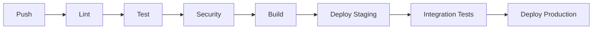

# Python 工程指南：现代开发实践

## 目录
1. [Python 工程简介](#python-工程简介)
2. [项目初始化与配置](#项目初始化与配置)
3. [开发环境管理](#开发环境管理)
4. [代码质量与规范](#代码质量与规范)
5. [测试与质量保障](#测试与质量保障)
6. [依赖管理](#依赖管理)
7. [持续集成与部署](#持续集成与部署)
8. [文档与维护](#文档与维护)
9. [性能与优化](#性能与优化)
10. [安全最佳实践](#安全最佳实践)

---

## Python 工程简介

### 什么是 Python 工程？

Python 工程涵盖了使用现代工具、实践和方法论系统性地开发、部署和维护 Python 应用的全过程。它不仅仅是编写 Python 代码，还包括从项目初始化到生产部署、长期维护的整个软件开发生命周期。

### 核心原则

| 原则 | 描述 | 重要性 |
|------|------|--------|
| **自动化** | 自动化重复性任务和流程 | 降低人为错误，提高效率 |
| **一致性** | 使用标准化工具和工作流 | 提升团队协作和代码质量 |
| **可复现性** | 确保构建和环境一致 | 便于可靠部署和调试 |
| **可扩展性** | 设计可扩展和可维护 | 让代码库具备未来适应性 |
| **安全性** | 从一开始就实施安全措施 | 防止漏洞和数据泄露 |

### 工程化 vs 脚本化

| 方面 | 脚本化 | 工程化 |
|------|--------|--------|
| **范围** | 单一用途，小规模 | 复杂系统，大规模 |
| **结构** | 简单线性 | 模块化、组织化 |
| **测试** | 极少或无 | 完善测试体系 |
| **依赖** | 手动、临时 | 管理、版本化 |
| **部署** | 手动执行 | 自动化流水线 |
| **维护** | 被动 | 主动 |

---

## 项目初始化与配置

### 现代项目结构

一个结构合理的 Python 项目应遵循如下约定：

```
project-name/
├── .gitignore              # Git 忽略规则
├── .python-version         # Python 版本指定
├── pyproject.toml          # 项目配置（🔑 详见专用指南）
├── uv.lock                 # 通用锁文件（需提交到 VCS）
├── README.md               # 项目文档
├── CHANGELOG.md            # 版本历史
├── src/                    # 源代码（推荐布局）
│   └── project_name/
│       ├── __init__.py
│       ├── main.py
│       └── modules/
├── tests/                  # 测试文件
│   ├── __init__.py
│   ├── test_main.py
│   └── conftest.py
├── docs/                   # 文档源码
│   ├── conf.py
│   └── index.md
├── scripts/                # 工具脚本
├── .github/                # CI/CD 工作流
│   └── workflows/
└── requirements/           # 传统依赖文件（如有需要）
    ├── base.txt
    └── dev.txt
```

### 配置文件概览

| 文件 | 作用 | 管理方式 |
|------|------|----------|
| **pyproject.toml** | 🎯 **核心配置文件** | [完整指南 →](pyproject-guide-zh-CN.md) |
| **requirements.txt** | 传统依赖列表 | 用 `uv pip compile` 生成 |
| **Pipfile/Poetry.lock** | 其他锁文件 | 迁移到 uv.lock |
| **setup.py/setup.cfg** | 传统构建脚本 | 迁移到 pyproject.toml |
| **tox.ini** | 测试配置 | 合并到 pyproject.toml |

### 项目元数据示例

```toml
[project]
name = "your-project"
version = "1.0.0"
description = "项目简要描述"
readme = "README.md"
license = {text = "MIT"}
authors = [
    {name = "你的名字", email = "your.email@example.com"}
]
maintainers = [
    {name = "维护者", email = "maintainer@example.com"}
]
classifiers = [
    "Development Status :: 4 - Beta",
    "Intended Audience :: Developers",
    "License :: OSI Approved :: MIT License",
    "Programming Language :: Python :: 3",
    "Programming Language :: Python :: 3.8",
    "Programming Language :: Python :: 3.9",
    "Programming Language :: Python :: 3.10",
    "Programming Language :: Python :: 3.11",
    "Programming Language :: Python :: 3.12",
]
keywords = ["python", "engineering", "best-practices"]
requires-python = ">=3.8"
```

> **📖 深入阅读**：完整 pyproject.toml 配置详见 [pyproject.toml 完整指南](pyproject-guide-zh-CN.md)

---

## 开发环境管理

### Python 版本管理

| 工具 | 方式 | 推荐 |
|------|------|------|
| **uv python** | 与 uv 集成 | ✅ **推荐** |
| **pyenv** | 独立版本管理器 | ✅ 可选 |
| **系统 Python** | 操作系统自带 | ⚠️ 不推荐开发使用 |
| **conda** | 环境+版本管理 | ✅ 数据科学适用 |

#### uv Python 管理示例

```bash
# 安装 Python 版本
uv python install 3.11 3.12

# 列出可用版本
uv python list

# 固定项目 Python 版本
uv python pin 3.11

# 用指定版本创建环境
uv venv --python 3.11
```

### 虚拟环境策略

| 策略 | 命令 | 使用场景 |
|------|------|----------|
| **自动管理** | `uv run script.py` | ✅ **推荐**日常开发 |
| **显式 venv** | `uv venv && source .venv/bin/activate` | 传统工作流 |
| **多环境** | `uv venv .venv-dev`, `uv venv .venv-test` | 隔离环境 |
| **容器化** | Docker + uv | 生产/部署 |

### 环境隔离最佳实践

1. **开发绝不使用系统 Python**
2. **将 `.python-version` 提交到版本控制**
3. **使用环境分组管理依赖**
4. **CI/CD 自动化环境初始化**
5. **清晰记录环境需求**

> **📖 深入阅读**：uv 用法详见 [uv 完整指南](uv-guide-zh-CN.md)

---

## 代码质量与规范

### 现代代码质量工具栈

| 类别 | 现代工具 | 传统工具 | 优势 |
|------|----------|---------|------|
| **Lint** | Ruff | Pylint, Flake8 | 10-100倍速度，规则全面 |
| **格式化** | Ruff Format | Black, autopep8 | 与 linter 一体，快 |
| **类型检查** | MyPy | 无需 | 静态类型验证 |
| **导入排序** | Ruff | isort | Ruff 内置 |
| **安全** | Ruff (bandit) | bandit, safety | 集成更快 |

### 代码质量实现

#### pyproject.toml 完整配置

```toml
[tool.ruff]
line-length = 88
target-version = "py38"

[tool.ruff.lint]
select = ["E", "F", "W", "I", "N", "B", "C90", "UP", "S"]
ignore = ["E501", "B008"]

[tool.ruff.lint.per-file-ignores]
"__init__.py" = ["F401"]
"tests/*" = ["S101"]

[tool.ruff.format]
quote-style = "double"
indent-style = "space"
line-ending = "auto"

[tool.mypy]
python_version = "3.8"
warn_return_any = true
warn_unused_configs = true
disallow_untyped_defs = true
```

### Pre-commit 集成

```yaml
# .pre-commit-config.yaml
repos:
  - repo: https://github.com/astral-sh/ruff-pre-commit
    rev: v0.1.0
    hooks:
      - id: ruff
        args: [--fix]
      - id: ruff-format

  - repo: https://github.com/pre-commit/mirrors-mypy
    rev: v1.0.0
    hooks:
      - id: mypy
        additional_dependencies: [types-requests]
```

### CI/CD 质量门槛

```yaml
# GitHub Actions
- name: 代码质量检查
  run: |
    uv run ruff check src/
    uv run ruff format --check src/
    uv run mypy src/
    uv run pytest --cov=src --cov-fail-under=80
```

> **📖 深入阅读**：工具对比详见 [Python 代码质量工具简介](python-tools-introduction-zh-CN.md)

---

## 测试与质量保障

### 测试金字塔

| 层级 | 目的 | 工具 | 覆盖目标 |
|------|------|------|----------|
| **单元测试** | 测试单个函数/方法 | pytest, unittest | 80-90%+ |
| **集成测试** | 测试组件交互 | pytest, testcontainers | 60-70% |
| **端到端测试** | 测试完整流程 | playwright, selenium | 20-30% |
| **性能测试** | 关键路径基准 | pytest-benchmark, locust | 关键指标 |

### 现代测试配置

#### pytest 配置 (pyproject.toml)

```toml
[tool.pytest.ini_options]
minversion = "7.0"
addopts = ["-ra", "-q", "--strict-markers", "--strict-config", "--cov=src", "--cov-report=term-missing", "--cov-report=html", "--cov-report=xml", "--cov-fail-under=80"]
testpaths = ["tests"]
python_files = ["test_*.py", "*_test.py"]
python_classes = ["Test*"]
python_functions = ["test_*"]
markers = ["slow: 标记慢测试", "integration: 标记集成测试", "unit: 标记单元测试", "network: 标记需网络", "flaky: 标记不稳定测试"]
```

#### 测试结构示例

```
tests/
├── conftest.py              # pytest 配置与夹具
├── unit/                    # 单元测试
│   ├── test_models.py
│   └── test_utils.py
├── integration/             # 集成测试
│   ├── test_api.py
│   └── test_database.py
├── e2e/                     # 端到端测试
│   └── test_workflows.py
└── fixtures/                # 测试数据与 mock
    ├── sample_data.json
    └── mock_responses.py
```

### 质量保障实践

#### 1. 测试驱动开发 (TDD)

```bash
# TDD 流程
# 1. 写失败测试
# 2. 编写通过测试的最小代码
# 3. 重构
# 4. 循环

# 持续运行测试
uv run pytest --watch src/ tests/
```

#### 2. 性质测试（属性测试）

```python
import hypothesis
from hypothesis import strategies as st

@given(st.integers(min_value=0, max_value=100))
def test_additive_identity(x):
    assert x + 0 == x

@given(st.lists(st.integers()))
def test_sort_preserves_elements(lst):
    sorted_lst = sorted(lst)
    assert sorted(lst).count == lst.count
```

#### 3. 变异测试

```bash
# 安装 mutmut
uv add --dev mutmut

# 运行变异测试
uv run mutmut run --paths-to-mutate src/

# 高变异分数表示测试覆盖好
```

---

## 依赖管理

### uv 的现代依赖管理

| 功能 | 传统（pip） | 现代（uv） |
|------|-------------|------------|
| **安装速度** | 慢（秒级） | 快（毫秒级） |
| **依赖解析** | 基础解析器 | 高级解析器 |
| **锁文件** | requirements.txt | 通用 uv.lock |
| **环境管理** | 多工具分离 | 一体化 |
| **跨平台** | 平台相关 | 通用锁文件 |

### 依赖分类

#### 生产依赖
```bash
# 添加生产依赖
uv add requests fastapi sqlalchemy
uv add 'requests>=2.28.0,<3.0.0'  # 版本约束
uv add 'fastapi[all]'             # 含 extras
```

#### 开发依赖
```bash
# 添加开发工具
uv add --dev pytest black ruff mypy
uv add --group test pytest-cov
uv add --group docs sphinx
```

#### 可选依赖
```toml
[project.optional-dependencies]
dev = ["pytest>=7.0.0", "black>=23.0.0", "ruff>=0.1.0", "mypy>=1.0.0"]
docs = ["sphinx>=5.0.0", "sphinx-rtd-theme>=1.0.0"]
test = ["pytest>=7.0.0", "pytest-cov>=4.0.0", "pytest-xdist>=3.0.0"]
```

### 锁文件管理

```bash
# 创建/更新锁文件
uv lock

# 更新指定包
uv lock --upgrade-package requests

# 刷新锁文件（忽略缓存）
uv lock --refresh

# 检查过期包
uv tree --outdated
```

### 安全扫描

```bash
# 检查已知漏洞
uv pip check

# CI 集成安全扫描
- name: 安全扫描
  run: |
    uv pip check
    uv pip list --format json | uv pip audit --require-from -
```

---

## 持续集成与部署

### CI/CD 流水线结构



### GitHub Actions 最佳实践

#### 完整 CI 工作流

```yaml
name: Python CI/CD

on:
  push:
    branches: [main, develop]
  pull_request:
    branches: [main]

jobs:
  test:
    runs-on: ubuntu-latest
    strategy:
      matrix:
        python-version: ["3.8", "3.9", "3.10", "3.11", "3.12"]
    steps:
      - uses: actions/checkout@v4
      - name: 设置 uv
        uses: astral-sh/setup-uv@v3
        with:
          version: "latest"
      - name: 设置 Python ${{ matrix.python-version }}
        run: uv python install ${{ matrix.python-version }}
      - name: 缓存依赖
        uses: actions/cache@v3
        with:
          path: ~/.cache/uv
          key: ${{ runner.os }}-uv-${{ hashFiles('pyproject.toml', 'uv.lock') }}
      - name: 安装依赖
        run: uv sync --all-extras
      - name: 代码质量检查
        run: |
          uv run ruff check src/
          uv run ruff format --check src/
          uv run mypy src/
      - name: 运行测试
        run: |
          uv run pytest --cov=src --cov-report=xml
      - name: 上传覆盖率
        uses: codecov/codecov-action@v3
        with:
          file: ./coverage.xml
  security:
    runs-on: ubuntu-latest
    steps:
      - uses: actions/checkout@v4
      - uses: astral-sh/setup-uv@v3
      - name: 安全审计
        run: |
          uv sync
          uv pip check
          uv pip list --format json | uv pip audit --require-from -
  build:
    needs: [test, security]
    runs-on: ubuntu-latest
    if: github.event_name == 'push'
    steps:
      - uses: actions/checkout@v4
      - uses: astral-sh/setup-uv@v3
      - name: 构建分发包
        run: uv build
      - name: 存储构建产物
        uses: actions/upload-artifact@v3
        with:
          name: dist
          path: dist/
  publish:
    needs: build
    runs-on: ubuntu-latest
    if: github.ref == 'refs/heads/main'
    steps:
      - uses: actions/checkout@v4
      - uses: astral-sh/setup-uv@v3
      - name: 下载产物
        uses: actions/download-artifact@v3
        with:
          name: dist
          path: dist/
      - name: 发布到 PyPI
        run: uv publish
        env:
          UV_PUBLISH_TOKEN: ${{ secrets.PYPI_TOKEN }}
```

### 部署策略

| 策略 | 描述 | 适用场景 |
|------|------|----------|
| **蓝绿部署** | 两套环境切换 | 零停机部署 |
| **金丝雀** | 部分用户渐进发布 | 风险发布 |
| **滚动更新** | 逐步替换实例 | 有状态应用 |
| **GitOps** | Git 驱动部署 | 云原生/Kubernetes |

### 监控与可观测性

#### 应用监控示例

```python
# 结构化日志
import logging
import json
from datetime import datetime

class StructuredLogger:
    def __init__(self, name: str):
        self.logger = logging.getLogger(name)
    def log_event(self, event: str, level: str = "INFO", **kwargs):
        log_data = {
            "timestamp": datetime.utcnow().isoformat(),
            "event": event,
            "level": level,
            **kwargs
        }
        getattr(self.logger, level.lower())(json.dumps(log_data))

# 用法
logger = StructuredLogger(__name__)
logger.log_event("user_login", user_id="123", ip="192.168.1.1")
```

---

## 文档与维护

### 文档策略

| 类型 | 作用 | 工具 | 位置 |
|------|------|------|------|
| **API 文档** | 代码参考 | Sphinx, pdoc | docs/api/ |
| **用户指南** | 使用教程 | MkDocs, GitBook | docs/guide/ |
| **架构文档** | 系统设计 | Markdown, 图示 | docs/architecture/ |
| **变更日志** | 版本历史 | Towncrier, 手工 | CHANGELOG.md |
| **贡献指南** | 开发流程 | Markdown | CONTRIBUTING.md |

### 文档自动化

#### Sphinx 配置

```toml
[tool.sphinx]
source-dir = "docs"
build-dir = "docs/_build"

[tool.sphinx.config]
project = "My Project"
author = "你的名字"
release = "1.0.0"
extensions = ["sphinx.ext.autodoc", "sphinx.ext.viewcode", "sphinx.ext.napoleon", "myst_parser"]
html_theme = "sphinx_rtd_theme"
```

#### CI 自动化文档

```yaml
- name: 构建文档
  run: |
    uv add --group docs sphinx sphinx-rtd-theme
    uv run sphinx-build -b html docs/ docs/_build/
- name: 部署文档
  if: github.ref == 'refs/heads/main'
  uses: peaceiris/actions-gh-pages@v3
  with:
    github_token: ${{ secrets.GITHUB_TOKEN }}
    publish_dir: ./docs/_build/
```

### 维护实践

#### 1. 定期更新

```bash
# 检查过期依赖
uv tree --outdated
# 安全更新依赖
uv lock --upgrade
# 交互式依赖审查
pip-review --interactive
```

#### 2. 依赖健康监控

```yaml
# 每周依赖检查
name: Dependency Health
on:
  schedule:
    - cron: "0 0 * * 1"  # 每周一
jobs:
  dependency-check:
    runs-on: ubuntu-latest
    steps:
      - uses: actions/checkout@v4
      - uses: astral-sh/setup-uv@v3
      - name: 检查依赖
        run: |
          uv sync
          uv pip check
          pip-audit --requirement uv.lock
```

#### 3. 性能监控

```python
# 性能基准测试
import pytest
import time

@pytest.mark.performance
def test_api_response_time():
    start_time = time.time()
    response = api_call()
    response_time = time.time() - start_time
    assert response_time < 0.1, f"响应过慢: {response_time}s"
```

---

## 性能与优化

### Python 应用性能分析

| 工具 | 用途 | 集成方式 |
|------|------|----------|
| **cProfile** | 内置分析 | `python -m cProfile script.py` |
| **py-spy** | 生产分析 | 采样分析器 |
| **memory-profiler** | 内存分析 | 行级内存 |
| **line-profiler** | CPU 热点分析 | 行级时间 |

#### 性能测试设置

```python
# conftest.py
import pytest
import time

@pytest.fixture
def benchmark():
    """简单基准夹具"""
    def _benchmark(func, *args, iterations=1000, **kwargs):
        start = time.perf_counter()
        for _ in range(iterations):
            func(*args, **kwargs)
        end = time.perf_counter()
        return (end - start) / iterations
    return _benchmark

# test_performance.py
def test_function_performance(benchmark):
    avg_time = benchmark(my_function, test_data)
    assert avg_time < 0.001, f"函数过慢: {avg_time:.6f}s"
```

### 优化策略

#### 1. 算法优化

```python
# 前: O(n²) 嵌套循环
def find_duplicates_slow(items):
    duplicates = []
    for i, item1 in enumerate(items):
        for j, item2 in enumerate(items[i+1:], i+1):
            if item1 == item2 and item1 not in duplicates:
                duplicates.append(item1)
    return duplicates

# 后: O(n) 用集合
def find_duplicates_fast(items):
    seen = set()
    duplicates = set()
    for item in items:
        if item in seen:
            duplicates.add(item)
        seen.add(item)
    return list(duplicates)
```

#### 2. 内存优化

```python
# 内存高效处理大文件
def process_large_file(filename):
    """不加载到内存处理大文件"""
    with open(filename, 'r') as f:
        for line in f:
            yield process_line(line)

# 生成器表达式 vs 列表推导
# 不推荐: 全部加载到内存
squares = [x**2 for x in range(1000000)]
# 推荐: 生成器，最小内存
squares = (x**2 for x in range(1000000))
```

#### 3. 缓存策略

```python
from functools import lru_cache
import joblib
import diskcache as dc

# 内存缓存
@lru_cache(maxsize=128)
def expensive_computation(x, y):
    return complex_calculation(x, y)

# 磁盘缓存
cache = dc.Cache('./cache_dir')
@cache.memoize()
def large_computation(data):
    result = process_large_data(data)
    return result

# joblib 函数缓存
@joblib.Memory('./joblib_cache', verbose=0).cache
def ml_model_prediction(features):
    model = load_model()
    return model.predict(features)
```

---

## 安全最佳实践

### 安全检查表

| 类别 | 实践 | 实现方式 |
|------|------|----------|
| **依赖** | 定期安全审计 | `uv pip audit`, Dependabot |
| **输入校验** | 所有输入都需校验 | Pydantic, validators |
| **认证** | 使用安全认证模式 | JWT, OAuth2 |
| **数据保护** | 加密敏感数据 | cryptography, Fernet |
| **环境变量** | 不提交密钥 | `.env` 文件、密钥库 |
| **错误处理** | 不暴露内部信息 | 自定义错误页 |
| **HTTPS** | 强制 TLS | 证书、HSTS |

### 安全实现示例

#### Pydantic 输入校验

```python
from pydantic import BaseModel, EmailStr, validator
import re

class UserRegistration(BaseModel):
    username: str
    email: EmailStr
    password: str
    @validator('username')
    def validate_username(cls, v):
        if len(v) < 3 or len(v) > 20:
            raise ValueError('用户名需 3-20 字符')
        if not re.match(r'^[a-zA-Z0-9_]+$', v):
            raise ValueError('用户名只能包含字母、数字和下划线')
        return v
    @validator('password')
    def validate_password(cls, v):
        if len(v) < 8:
            raise ValueError('密码至少 8 位')
        if not re.search(r'[A-Z]', v):
            raise ValueError('密码需包含大写字母')
        if not re.search(r'[a-z]', v):
            raise ValueError('密码需包含小写字母')
        if not re.search(r'\d', v):
            raise ValueError('密码需包含数字')
        return v
```

#### 安全配置管理

```python
import os
from typing import Optional
from cryptography.fernet import Fernet

class SecureConfig:
    def __init__(self):
        self._encryption_key = self._load_or_create_key()
        self._cipher = Fernet(self._encryption_key)
    def _load_or_create_key(self) -> bytes:
        key_file = os.environ.get('ENCRYPTION_KEY_FILE', '.encryption_key')
        if os.path.exists(key_file):
            with open(key_file, 'rb') as f:
                return f.read()
        else:
            key = Fernet.generate_key()
            with open(key_file, 'wb') as f:
                f.write(key)
            os.chmod(key_file, 0o600)
            return key
    def encrypt_sensitive_data(self, data: str) -> str:
        return self._cipher.encrypt(data.encode()).decode()
    def decrypt_sensitive_data(self, encrypted_data: str) -> str:
        return self._cipher.decrypt(encrypted_data.encode()).decode()
    def get_database_url(self) -> str:
        encrypted_url = os.environ.get('DATABASE_URL_ENCRYPTED')
        if encrypted_url:
            return self.decrypt_sensitive_data(encrypted_url)
        raise ValueError("未找到或未加密数据库 URL")
```

#### 安全头中间件

```python
from fastapi import FastAPI, Request
from fastapi.middleware.cors import CORSMiddleware
from fastapi.middleware.trustedhost import TrustedHostMiddleware

app = FastAPI()

@app.middleware("http")
async def add_security_headers(request: Request, call_next):
    response = await call_next(request)
    response.headers["X-Content-Type-Options"] = "nosniff"
    response.headers["X-Frame-Options"] = "DENY"
    response.headers["X-XSS-Protection"] = "1; mode=block"
    response.headers["Strict-Transport-Security"] = "max-age=31536000; includeSubDomains"
    response.headers["Content-Security-Policy"] = "default-src 'self'"
    return response

app.add_middleware(
    TrustedHostMiddleware, 
    allowed_hosts=["yourdomain.com", "*.yourdomain.com"]
)
app.add_middleware(
    CORSMiddleware,
    allow_origins=["https://yourdomain.com"],
    allow_credentials=True,
    allow_methods=["GET", "POST"],
    allow_headers=["*"],
)
```

### 安全测试

```python
import pytest
from fastapi.testclient import TestClient
from your_app import app

client = TestClient(app)

def test_sql_injection_protection():
    """SQL 注入防护测试"""
    malicious_input = "'; DROP TABLE users; --"
    response = client.post("/search", json={"query": malicious_input})
    assert response.status_code != 500
    assert "error" in response.json().lower()

def test_xss_protection():
    """XSS 防护测试"""
    xss_payload = "<script>alert('xss')</script>"
    response = client.post("/comment", json={"text": xss_payload})
    assert "<script>" not in response.text

def test_rate_limiting():
    """限流测试"""
    for _ in range(100):
        response = client.post("/api/endpoint")
    assert response.status_code == 429
```

---

## 资源链接与扩展阅读

### 官方文档

| 主题 | 资源 | 链接 |
|------|------|------|
| **Python 打包** | 打包用户指南 | https://packaging.python.org/ |
| **PEP 标准** | Python 增强提案 | https://peps.python.org/ |
| **uv 文档** | 官方 uv 指南 | https://docs.astral.sh/uv/ |
| **Ruff 文档** | 官方 Ruff 指南 | https://docs.astral.sh/ruff/ |
| **pytest 文档** | pytest 测试指南 | https://docs.pytest.org/ |
| **MyPy 文档** | 静态类型检查 | https://mypy.readthedocs.io/ |

### 本仓库专用指南

| 指南 | 重点 | 链接 |
|------|------|------|
| **[pyproject.toml 指南](pyproject-guide-zh-CN.md)** | 项目完整配置 | 🔗 本地 |
| **[uv 指南](uv-guide-zh-CN.md)** | 现代依赖管理 | 🔗 本地 |
| **[代码质量工具](python-tools-introduction-zh-CN.md)** | Lint、格式化、类型检查 | 🔗 本地 |

### 社区资源

| 资源 | 类型 | 描述 |
|------|------|------|
| **Python Discourse** | 社区论坛 | 官方 Python 讨论区 |
| **Reddit r/Python** | 社区 | Python 新闻与讨论 |
| **Real Python** | 教程 | 深度 Python 教程 |
| **Python Weekly** | 周报 | 每周 Python 新闻与文章 |
| **Talk Python Podcast** | 播客 | Python 访谈与讨论 |

### 书籍与课程

| 资源 | 难度 | 重点 |
|------|------|------|
| **Effective Python** | 中级 | 最佳实践与惯用法 |
| **Fluent Python** | 高级 | 深入 Python 内部 |
| **Architecture Patterns with Python** | 高级 | 系统设计模式 |
| **Python for DevOps** | 中级 | DevOps 自动化 |
| **Test-Driven Development with Python** | 中级 | TDD 方法论 |

### 工具与库

| 类别 | 推荐工具 |
|------|----------|
| **依赖管理** | uv, pip, conda |
| **代码质量** | Ruff, MyPy, Black |
| **测试** | pytest, pytest-cov, pytest-mock |
| **文档** | Sphinx, MkDocs, pdoc |
| **Web 框架** | FastAPI, Django, Flask |
| **数据科学** | pandas, numpy, scikit-learn |
| **DevOps** | Docker, Kubernetes, GitHub Actions |

---

## 总结与关键要点

### 工程原则回顾

1. **自动化一切**：用工具消除重复劳动
2. **一致性至上**：标准化工具、流程和代码风格
3. **质量优先**：从第一天起注重质量
4. **安全设计**：全流程实施安全措施
5. **性能意识**：编写高效代码并测量性能
6. **文档即代码**：把文档视为代码的一部分
7. **持续改进**：定期更新依赖和实践

### 推荐工具栈（2024）

| 目的 | 工具 | 理由 |
|------|------|------|
| **依赖管理** | **uv** | 10-100倍速度，工具链一体化 |
| **项目配置** | **pyproject.toml** | 标准、全面配置 |
| **代码质量** | **Ruff + MyPy** | 快速、全面、现代 |
| **测试** | **pytest** | 功能丰富，插件生态 |
| **文档** | **Sphinx/MkDocs** | 专业、自动生成 |
| **CI/CD** | **GitHub Actions** | 集成、灵活、免费 |

### 迁移路径

1. **优先用 uv**：立即替换 pip
2. **统一配置**：将所有配置合并到 pyproject.toml
3. **采用 Ruff**：替换多工具为 Ruff
4. **完善测试**：配置 pytest 与覆盖率
5. **集成 CI/CD**：自动化质量与部署
6. **完善文档**：创建全面文档

### 下一步建议

1. **评估现状**：分析现有工具与流程
2. **制定迁移计划**：逐步采用现代实践
3. **小步快跑**：优先高影响变更（uv、Ruff）
4. **衡量效果**：跟踪速度、质量与开发体验提升
5. **持续迭代**：不断优化工程实践

---

*本指南为 Python 工程实践的全面综述。具体工具和配置细节请参考文中链接的专用指南。*