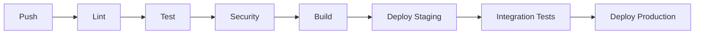

# Python 工程指南：現代開發實踐

## 目錄
1. [Python 工程簡介](#python-工程簡介)
2. [項目初始化與配置](#項目初始化與配置)
3. [開發環境管理](#開發環境管理)
4. [代碼質量與規範](#代碼質量與規範)
5. [測試與質量保障](#測試與質量保障)
6. [依賴管理](#依賴管理)
7. [持續集成與部署](#持續集成與部署)
8. [文件與維護](#文件與維護)
9. [性能與優化](#性能與優化)
10. [安全最佳實踐](#安全最佳實踐)

---

## Python 工程簡介

### 什麼是 Python 工程？

Python 工程涵蓋了使用現代工具、實踐和方法論系統性地開發、部署和維護 Python 應用的全過程。它不僅僅是編寫 Python 代碼，還包括從項目初始化到生產部署、長期維護的整個軟件開發生命週期。

### 核心原則

| 原則 | 描述 | 重要性 |
|------|------|--------|
| **自動化** | 自動化重複性任務和流程 | 降低人為錯誤，提高效率 |
| **一致性** | 使用標準化工具和工作流 | 提升團隊協作和代碼質量 |
| **可重現性** | 確保構建和環境一致 | 便於可靠部署和調試 |
| **可擴展性** | 設計可擴展和可維護 | 讓代碼庫具備未來適應性 |
| **安全性** | 從一開始就實施安全措施 | 防止漏洞和數據洩露 |

### 工程化 vs 腳本化

| 方面 | 腳本化 | 工程化 |
|------|--------|--------|
| **範圍** | 單一用途，小規模 | 複雜系統，大規模 |
| **結構** | 簡單線性 | 模組化、組織化 |
| **測試** | 極少或無 | 完善測試體系 |
| **依賴** | 手動、臨時 | 管理、版本化 |
| **部署** | 手動執行 | 自動化流水線 |
| **維護** | 被動 | 主動 |

---

## 項目初始化與配置

### 現代項目結構

一個結構合理的 Python 項目應遵循如下約定：

```
project-name/
├── .gitignore              # Git 忽略規則
├── .python-version         # Python 版本指定
├── pyproject.toml          # 項目配置（🔑 詳見專用指南）
├── uv.lock                 # 通用鎖文件（需提交到 VCS）
├── README.md               # 項目文件
├── CHANGELOG.md            # 版本歷史
├── src/                    # 源代碼（推薦布局）
│   └── project_name/
│       ├── __init__.py
│       ├── main.py
│       └── modules/
├── tests/                  # 測試文件
│   ├── __init__.py
│   ├── test_main.py
│   └── conftest.py
├── docs/                   # 文件源碼
│   ├── conf.py
│   └── index.md
├── scripts/                # 工具腳本
├── .github/                # CI/CD 工作流
│   └── workflows/
└── requirements/           # 傳統依賴文件（如有需要）
    ├── base.txt
    └── dev.txt
```

### 配置文件概覽

| 文件 | 作用 | 管理方式 |
|------|------|----------|
| **pyproject.toml** | 🎯 **核心配置文件** | [完整指南 →](pyproject-guide-zh-HK.md) |
| **requirements.txt** | 傳統依賴列表 | 用 `uv pip compile` 生成 |
| **Pipfile/Poetry.lock** | 其他鎖文件 | 遷移到 uv.lock |
| **setup.py/setup.cfg** | 傳統構建腳本 | 遷移到 pyproject.toml |
| **tox.ini** | 測試配置 | 合併到 pyproject.toml |

### 項目元數據示例

```toml
[project]
name = "your-project"
version = "1.0.0"
description = "項目簡要描述"
readme = "README.md"
license = {text = "MIT"}
authors = [
    {name = "你的名字", email = "your.email@example.com"}
]
maintainers = [
    {name = "維護者", email = "maintainer@example.com"}
]
classifiers = [
    "Development Status :: 4 - Beta",
    "Intended Audience :: Developers",
    "License :: OSI Approved :: MIT License",
    "Programming Language :: Python :: 3",
    "Programming Language :: Python :: 3.8",
    "Programming Language :: Python :: 3.9",
    "Programming Language :: Python :: 3.10",
    "Programming Language :: Python :: 3.11",
    "Programming Language :: Python :: 3.12",
]
keywords = ["python", "engineering", "best-practices"]
requires-python = ">=3.8"
```

> **📖 深入閱讀**：完整 pyproject.toml 配置詳見 [pyproject.toml 完整指南](pyproject-guide-zh-HK.md)

---

## 開發環境管理

### Python 版本管理

| 工具 | 方式 | 推薦 |
|------|------|------|
| **uv python** | 與 uv 集成 | ✅ **推薦** |
| **pyenv** | 獨立版本管理器 | ✅ 可選 |
| **系統 Python** | 操作系統自帶 | ⚠️ 不推薦開發使用 |
| **conda** | 環境+版本管理 | ✅ 數據科學適用 |

#### uv Python 管理示例

```bash
# 安裝 Python 版本
uv python install 3.11 3.12

# 列出可用版本
uv python list

# 固定項目 Python 版本
uv python pin 3.11

# 用指定版本創建環境
uv venv --python 3.11
```

### 虛擬環境策略

| 策略 | 命令 | 使用場景 |
|------|------|----------|
| **自動管理** | `uv run script.py` | ✅ **推薦**日常開發 |
| **顯式 venv** | `uv venv && source .venv/bin/activate` | 傳統工作流 |
| **多環境** | `uv venv .venv-dev`, `uv venv .venv-test` | 隔離環境 |
| **容器化** | Docker + uv | 生產/部署 |

### 環境隔離最佳實踐

1. **開發絕不使用系統 Python**
2. **將 `.python-version` 提交到版本控制**
3. **使用環境分組管理依賴**
4. **CI/CD 自動化環境初始化**
5. **清晰記錄環境需求**

> **📖 深入閱讀**：uv 用法詳見 [uv 完整指南](uv-guide-zh-HK.md)

---

## 代碼質量與規範

### 現代代碼質量工具棧

| 類別 | 現代工具 | 傳統工具 | 優勢 |
|------|----------|---------|------|
| **Lint** | Ruff | Pylint, Flake8 | 10-100倍速度，規則全面 |
| **格式化** | Ruff Format | Black, autopep8 | 與 linter 一體，快 |
| **類型檢查** | MyPy | 無需 | 靜態類型驗證 |
| **導入排序** | Ruff | isort | Ruff 內置 |
| **安全** | Ruff (bandit) | bandit, safety | 集成更快 |

### 代碼質量實現

#### pyproject.toml 完整配置

```toml
[tool.ruff]
line-length = 88
target-version = "py38"

[tool.ruff.lint]
select = ["E", "F", "W", "I", "N", "B", "C90", "UP", "S"]
ignore = ["E501", "B008"]

[tool.ruff.lint.per-file-ignores]
"__init__.py" = ["F401"]
"tests/*" = ["S101"]

[tool.ruff.format]
quote-style = "double"
indent-style = "space"
line-ending = "auto"

[tool.mypy]
python_version = "3.8"
warn_return_any = true
warn_unused_configs = true
disallow_untyped_defs = true
```

### Pre-commit 集成

```yaml
# .pre-commit-config.yaml
repos:
  - repo: https://github.com/astral-sh/ruff-pre-commit
    rev: v0.1.0
    hooks:
      - id: ruff
        args: [--fix]
      - id: ruff-format

  - repo: https://github.com/pre-commit/mirrors-mypy
    rev: v1.0.0
    hooks:
      - id: mypy
        additional_dependencies: [types-requests]
```

### CI/CD 質量門檻

```yaml
# GitHub Actions
- name: 代碼質量檢查
  run: |
    uv run ruff check src/
    uv run ruff format --check src/
    uv run mypy src/
    uv run pytest --cov=src --cov-fail-under=80
```

> **📖 深入閱讀**：工具對比詳見 [Python 代碼質量工具簡介](python-tools-introduction-zh-HK.md)

---

## 測試與質量保障

### 測試金字塔

| 層級 | 目的 | 工具 | 覆蓋目標 |
|------|------|------|----------|
| **單元測試** | 測試單個函數/方法 | pytest, unittest | 80-90%+ |
| **集成測試** | 測試組件交互 | pytest, testcontainers | 60-70% |
| **端到端測試** | 測試完整流程 | playwright, selenium | 20-30% |
| **性能測試** | 關鍵路徑基準 | pytest-benchmark, locust | 關鍵指標 |

### 現代測試配置

#### pytest 配置 (pyproject.toml)

```toml
[tool.pytest.ini_options]
minversion = "7.0"
addopts = ["-ra", "-q", "--strict-markers", "--strict-config", "--cov=src", "--cov-report=term-missing", "--cov-report=html", "--cov-report=xml", "--cov-fail-under=80"]
testpaths = ["tests"]
python_files = ["test_*.py", "*_test.py"]
python_classes = ["Test*"]
python_functions = ["test_*"]
markers = ["slow: 標記慢測試", "integration: 標記集成測試", "unit: 標記單元測試", "network: 標記需網絡", "flaky: 標記不穩定測試"]
```

#### 測試結構示例

```
tests/
├── conftest.py              # pytest 配置與夾具
├── unit/                    # 單元測試
│   ├── test_models.py
│   └── test_utils.py
├── integration/             # 集成測試
│   ├── test_api.py
│   └── test_database.py
├── e2e/                     # 端到端測試
│   └── test_workflows.py
└── fixtures/                # 測試數據與 mock
    ├── sample_data.json
    └── mock_responses.py
```

### 質量保障實踐

#### 1. 測試驅動開發 (TDD)

```bash
# TDD 流程
# 1. 寫失敗測試
# 2. 編寫通過測試的最小代碼
# 3. 重構
# 4. 循環

# 持續運行測試
uv run pytest --watch src/ tests/
```

#### 2. 性質測試（屬性測試）

```python
import hypothesis
from hypothesis import strategies as st

@given(st.integers(min_value=0, max_value=100))
def test_additive_identity(x):
    assert x + 0 == x

@given(st.lists(st.integers()))
def test_sort_preserves_elements(lst):
    sorted_lst = sorted(lst)
    assert sorted(lst).count == lst.count
```

#### 3. 變異測試

```bash
# 安裝 mutmut
uv add --dev mutmut

# 運行變異測試
uv run mutmut run --paths-to-mutate src/

# 高變異分數表示測試覆蓋好
```

---

## 依賴管理

### uv 的現代依賴管理

| 功能 | 傳統（pip） | 現代（uv） |
|------|-------------|------------|
| **安裝速度** | 慢（秒級） | 快（毫秒級） |
| **依賴解析** | 基礎解析器 | 高級解析器 |
| **鎖文件** | requirements.txt | 通用 uv.lock |
| **環境管理** | 多工具分離 | 一體化 |
| **跨平台** | 平台相關 | 通用鎖文件 |

### 依賴分類

#### 生產依賴
```bash
# 添加生產依賴
uv add requests fastapi sqlalchemy
uv add 'requests>=2.28.0,<3.0.0'  # 版本約束
uv add 'fastapi[all]'             # 含 extras
```

#### 開發依賴
```bash
# 添加開發工具
uv add --dev pytest black ruff mypy
uv add --group test pytest-cov
uv add --group docs sphinx
```

#### 可選依賴
```toml
[project.optional-dependencies]
dev = ["pytest>=7.0.0", "black>=23.0.0", "ruff>=0.1.0", "mypy>=1.0.0"]
docs = ["sphinx>=5.0.0", "sphinx-rtd-theme>=1.0.0"]
test = ["pytest>=7.0.0", "pytest-cov>=4.0.0", "pytest-xdist>=3.0.0"]
```

### 鎖文件管理

```bash
# 創建/更新鎖文件
uv lock

# 更新指定包
uv lock --upgrade-package requests

# 刷新鎖文件（忽略緩存）
uv lock --refresh

# 檢查過期包
uv tree --outdated
```

### 安全掃描

```bash
# 檢查已知漏洞
uv pip check

# CI 集成安全掃描
- name: 安全掃描
  run: |
    uv pip check
    uv pip list --format json | uv pip audit --require-from -
```

---

## 持續集成與部署

### CI/CD 流水線結構



### GitHub Actions 最佳實踐

#### 完整 CI 工作流

```yaml
name: Python CI/CD

on:
  push:
    branches: [main, develop]
  pull_request:
    branches: [main]

jobs:
  test:
    runs-on: ubuntu-latest
    strategy:
      matrix:
        python-version: ["3.8", "3.9", "3.10", "3.11", "3.12"]
    steps:
      - uses: actions/checkout@v4
      - name: 設置 uv
        uses: astral-sh/setup-uv@v3
        with:
          version: "latest"
      - name: 設置 Python ${{ matrix.python-version }}
        run: uv python install ${{ matrix.python-version }}
      - name: 緩存依賴
        uses: actions/cache@v3
        with:
          path: ~/.cache/uv
          key: ${{ runner.os }}-uv-${{ hashFiles('pyproject.toml', 'uv.lock') }}
      - name: 安裝依賴
        run: uv sync --all-extras
      - name: 代碼質量檢查
        run: |
          uv run ruff check src/
          uv run ruff format --check src/
          uv run mypy src/
      - name: 運行測試
        run: |
          uv run pytest --cov=src --cov-report=xml
      - name: 上傳覆蓋率
        uses: codecov/codecov-action@v3
        with:
          file: ./coverage.xml
  security:
    runs-on: ubuntu-latest
    steps:
      - uses: actions/checkout@v4
      - uses: astral-sh/setup-uv@v3
      - name: 安全審計
        run: |
          uv sync
          uv pip check
          uv pip list --format json | uv pip audit --require-from -
  build:
    needs: [test, security]
    runs-on: ubuntu-latest
    if: github.event_name == 'push'
    steps:
      - uses: actions/checkout@v4
      - uses: astral-sh/setup-uv@v3
      - name: 構建分發包
        run: uv build
      - name: 存儲構建產物
        uses: actions/upload-artifact@v3
        with:
          name: dist
          path: dist/
  publish:
    needs: build
    runs-on: ubuntu-latest
    if: github.ref == 'refs/heads/main'
    steps:
      - uses: actions/checkout@v4
      - uses: astral-sh/setup-uv@v3
      - name: 下載產物
        uses: actions/download-artifact@v3
        with:
          name: dist
          path: dist/
      - name: 發佈到 PyPI
        run: uv publish
        env:
          UV_PUBLISH_TOKEN: ${{ secrets.PYPI_TOKEN }}
```

### 部署策略

| 策略 | 描述 | 適用場景 |
|------|------|----------|
| **藍綠部署** | 兩套環境切換 | 零停機部署 |
| **金絲雀** | 部分用戶漸進發佈 | 風險發佈 |
| **滾動更新** | 逐步替換實例 | 有狀態應用 |
| **GitOps** | Git 驅動部署 | 雲原生/Kubernetes |

### 監控與可觀測性

#### 應用監控示例

```python
# 結構化日誌
import logging
import json
from datetime import datetime

class StructuredLogger:
    def __init__(self, name: str):
        self.logger = logging.getLogger(name)
    def log_event(self, event: str, level: str = "INFO", **kwargs):
        log_data = {
            "timestamp": datetime.utcnow().isoformat(),
            "event": event,
            "level": level,
            **kwargs
        }
        getattr(self.logger, level.lower())(json.dumps(log_data))

# 用法
logger = StructuredLogger(__name__)
logger.log_event("user_login", user_id="123", ip="192.168.1.1")
```

---

## 文件與維護

### 文件策略

| 類型 | 作用 | 工具 | 位置 |
|------|------|------|------|
| **API 文件** | 代碼參考 | Sphinx, pdoc | docs/api/ |
| **用戶指南** | 使用教學 | MkDocs, GitBook | docs/guide/ |
| **架構文件** | 系統設計 | Markdown, 圖示 | docs/architecture/ |
| **變更日誌** | 版本歷史 | Towncrier, 手工 | CHANGELOG.md |
| **貢獻指南** | 開發流程 | Markdown | CONTRIBUTING.md |

### 文件自動化

#### Sphinx 配置

```toml
[tool.sphinx]
source-dir = "docs"
build-dir = "docs/_build"

[tool.sphinx.config]
project = "My Project"
author = "你的名字"
release = "1.0.0"
extensions = ["sphinx.ext.autodoc", "sphinx.ext.viewcode", "sphinx.ext.napoleon", "myst_parser"]
html_theme = "sphinx_rtd_theme"
```

#### CI 自動化文件

```yaml
- name: 構建文件
  run: |
    uv add --group docs sphinx sphinx-rtd-theme
    uv run sphinx-build -b html docs/ docs/_build/
- name: 部署文件
  if: github.ref == 'refs/heads/main'
  uses: peaceiris/actions-gh-pages@v3
  with:
    github_token: ${{ secrets.GITHUB_TOKEN }}
    publish_dir: ./docs/_build/
```

### 維護實踐

#### 1. 定期更新

```bash
# 檢查過期依賴
uv tree --outdated
# 安全更新依賴
uv lock --upgrade
# 交互式依賴審查
pip-review --interactive
```

#### 2. 依賴健康監控

```yaml
# 每週依賴檢查
name: Dependency Health
on:
  schedule:
    - cron: "0 0 * * 1"  # 每週一
jobs:
  dependency-check:
    runs-on: ubuntu-latest
    steps:
      - uses: actions/checkout@v4
      - uses: astral-sh/setup-uv@v3
      - name: 檢查依賴
        run: |
          uv sync
          uv pip check
          pip-audit --requirement uv.lock
```

#### 3. 性能監控

```python
# 性能基準測試
import pytest
import time

@pytest.mark.performance
def test_api_response_time():
    start_time = time.time()
    response = api_call()
    response_time = time.time() - start_time
    assert response_time < 0.1, f"響應過慢: {response_time}s"
```

---

## 性能與優化

### Python 應用性能分析

| 工具 | 用途 | 集成方式 |
|------|------|----------|
| **cProfile** | 內置分析 | `python -m cProfile script.py` |
| **py-spy** | 生產分析 | 取樣分析器 |
| **memory-profiler** | 記憶體分析 | 行級記憶體 |
| **line-profiler** | CPU 熱點分析 | 行級時間 |

#### 性能測試設置

```python
# conftest.py
import pytest
import time

@pytest.fixture
def benchmark():
    """簡單基準夾具"""
    def _benchmark(func, *args, iterations=1000, **kwargs):
        start = time.perf_counter()
        for _ in range(iterations):
            func(*args, **kwargs)
        end = time.perf_counter()
        return (end - start) / iterations
    return _benchmark

# test_performance.py
def test_function_performance(benchmark):
    avg_time = benchmark(my_function, test_data)
    assert avg_time < 0.001, f"函數過慢: {avg_time:.6f}s"
```

### 優化策略

#### 1. 演算法優化

```python
# 前: O(n²) 巢狀迴圈
def find_duplicates_slow(items):
    duplicates = []
    for i, item1 in enumerate(items):
        for j, item2 in enumerate(items[i+1:], i+1):
            if item1 == item2 and item1 not in duplicates:
                duplicates.append(item1)
    return duplicates

# 後: O(n) 用集合
def find_duplicates_fast(items):
    seen = set()
    duplicates = set()
    for item in items:
        if item in seen:
            duplicates.add(item)
        seen.add(item)
    return list(duplicates)
```

#### 2. 記憶體優化

```python
# 記憶體高效處理大文件
def process_large_file(filename):
    """不加載到記憶體處理大文件"""
    with open(filename, 'r') as f:
        for line in f:
            yield process_line(line)

# 生成器表達式 vs 列表推導
# 不推薦: 全部加載到記憶體
squares = [x**2 for x in range(1000000)]
# 推薦: 生成器，最小記憶體
squares = (x**2 for x in range(1000000))
```

#### 3. 緩存策略

```python
from functools import lru_cache
import joblib
import diskcache as dc

# 記憶體緩存
@lru_cache(maxsize=128)
def expensive_computation(x, y):
    return complex_calculation(x, y)

# 磁盤緩存
cache = dc.Cache('./cache_dir')
@cache.memoize()
def large_computation(data):
    result = process_large_data(data)
    return result

# joblib 函數緩存
@joblib.Memory('./joblib_cache', verbose=0).cache
def ml_model_prediction(features):
    model = load_model()
    return model.predict(features)
```

---

## 安全最佳實踐

### 安全檢查表

| 類別 | 實踐 | 實現方式 |
|------|------|----------|
| **依賴** | 定期安全審計 | `uv pip audit`, Dependabot |
| **輸入校驗** | 所有輸入都需校驗 | Pydantic, validators |
| **認證** | 使用安全認證模式 | JWT, OAuth2 |
| **數據保護** | 加密敏感數據 | cryptography, Fernet |
| **環境變量** | 不提交密鑰 | `.env` 文件、密鑰庫 |
| **錯誤處理** | 不暴露內部信息 | 自定義錯誤頁 |
| **HTTPS** | 強制 TLS | 證書、HSTS |

### 安全實現示例

#### Pydantic 輸入校驗

```python
from pydantic import BaseModel, EmailStr, validator
import re

class UserRegistration(BaseModel):
    username: str
    email: EmailStr
    password: str
    @validator('username')
    def validate_username(cls, v):
        if len(v) < 3 or len(v) > 20:
            raise ValueError('用戶名需 3-20 字符')
        if not re.match(r'^[a-zA-Z0-9_]+$', v):
            raise ValueError('用戶名只能包含字母、數字和下劃線')
        return v
    @validator('password')
    def validate_password(cls, v):
        if len(v) < 8:
            raise ValueError('密碼至少 8 位')
        if not re.search(r'[A-Z]', v):
            raise ValueError('密碼需包含大寫字母')
        if not re.search(r'[a-z]', v):
            raise ValueError('密碼需包含小寫字母')
        if not re.search(r'\d', v):
            raise ValueError('密碼需包含數字')
        return v
```

#### 安全配置管理

```python
import os
from typing import Optional
from cryptography.fernet import Fernet

class SecureConfig:
    def __init__(self):
        self._encryption_key = self._load_or_create_key()
        self._cipher = Fernet(self._encryption_key)
    def _load_or_create_key(self) -> bytes:
        key_file = os.environ.get('ENCRYPTION_KEY_FILE', '.encryption_key')
        if os.path.exists(key_file):
            with open(key_file, 'rb') as f:
                return f.read()
        else:
            key = Fernet.generate_key()
            with open(key_file, 'wb') as f:
                f.write(key)
            os.chmod(key_file, 0o600)
            return key
    def encrypt_sensitive_data(self, data: str) -> str:
        return self._cipher.encrypt(data.encode()).decode()
    def decrypt_sensitive_data(self, encrypted_data: str) -> str:
        return self._cipher.decrypt(encrypted_data.encode()).decode()
    def get_database_url(self) -> str:
        encrypted_url = os.environ.get('DATABASE_URL_ENCRYPTED')
        if encrypted_url:
            return self.decrypt_sensitive_data(encrypted_url)
        raise ValueError("未找到或未加密數據庫 URL")
```

#### 安全頭中間件

```python
from fastapi import FastAPI, Request
from fastapi.middleware.cors import CORSMiddleware
from fastapi.middleware.trustedhost import TrustedHostMiddleware

app = FastAPI()

@app.middleware("http")
async def add_security_headers(request: Request, call_next):
    response = await call_next(request)
    response.headers["X-Content-Type-Options"] = "nosniff"
    response.headers["X-Frame-Options"] = "DENY"
    response.headers["X-XSS-Protection"] = "1; mode=block"
    response.headers["Strict-Transport-Security"] = "max-age=31536000; includeSubDomains"
    response.headers["Content-Security-Policy"] = "default-src 'self'"
    return response

app.add_middleware(
    TrustedHostMiddleware, 
    allowed_hosts=["yourdomain.com", "*.yourdomain.com"]
)
app.add_middleware(
    CORSMiddleware,
    allow_origins=["https://yourdomain.com"],
    allow_credentials=True,
    allow_methods=["GET", "POST"],
    allow_headers=["*"],
)
```

### 安全測試

```python
import pytest
from fastapi.testclient import TestClient
from your_app import app

client = TestClient(app)

def test_sql_injection_protection():
    """SQL 注入防護測試"""
    malicious_input = "'; DROP TABLE users; --"
    response = client.post("/search", json={"query": malicious_input})
    assert response.status_code != 500
    assert "error" in response.json().lower()

def test_xss_protection():
    """XSS 防護測試"""
    xss_payload = "<script>alert('xss')</script>"
    response = client.post("/comment", json={"text": xss_payload})
    assert "<script>" not in response.text

def test_rate_limiting():
    """限流測試"""
    for _ in range(100):
        response = client.post("/api/endpoint")
    assert response.status_code == 429
```

---

## 資源鏈接與擴展閱讀

### 官方文件

| 主題 | 資源 | 鏈接 |
|------|------|------|
| **Python 打包** | 打包用戶指南 | https://packaging.python.org/ |
| **PEP 標準** | Python 增強提案 | https://peps.python.org/ |
| **uv 文件** | 官方 uv 指南 | https://docs.astral.sh/uv/ |
| **Ruff 文件** | 官方 Ruff 指南 | https://docs.astral.sh/ruff/ |
| **pytest 文件** | pytest 測試指南 | https://docs.pytest.org/ |
| **MyPy 文件** | 靜態類型檢查 | https://mypy.readthedocs.io/ |

### 本倉庫專用指南

| 指南 | 重點 | 鏈接 |
|------|------|------|
| **[pyproject.toml 指南](pyproject-guide-zh-HK.md)** | 項目完整配置 | 🔗 本地 |
| **[uv 指南](uv-guide-zh-HK.md)** | 現代依賴管理 | 🔗 本地 |
| **[代碼質量工具](python-tools-introduction-zh-HK.md)** | Lint、格式化、類型檢查 | 🔗 本地 |

### 社區資源

| 資源 | 類型 | 描述 |
|------|------|------|
| **Python Discourse** | 社區論壇 | 官方 Python 討論區 |
| **Reddit r/Python** | 社區 | Python 新聞與討論 |
| **Real Python** | 教學 | 深度 Python 教學 |
| **Python Weekly** | 周報 | 每週 Python 新聞與文章 |
| **Talk Python Podcast** | 播客 | Python 訪談與討論 |

### 書籍與課程

| 資源 | 難度 | 重點 |
|------|------|------|
| **Effective Python** | 中級 | 最佳實踐與慣用法 |
| **Fluent Python** | 高級 | 深入 Python 內部 |
| **Architecture Patterns with Python** | 高級 | 系統設計模式 |
| **Python for DevOps** | 中級 | DevOps 自動化 |
| **Test-Driven Development with Python** | 中級 | TDD 方法論 |

### 工具與庫

| 類別 | 推薦工具 |
|------|----------|
| **依賴管理** | uv, pip, conda |
| **代碼質量** | Ruff, MyPy, Black |
| **測試** | pytest, pytest-cov, pytest-mock |
| **文件** | Sphinx, MkDocs, pdoc |
| **Web 框架** | FastAPI, Django, Flask |
| **數據科學** | pandas, numpy, scikit-learn |
| **DevOps** | Docker, Kubernetes, GitHub Actions |

---

## 總結與關鍵要點

### 工程原則回顧

1. **自動化一切**：用工具消除重複勞動
2. **一致性至上**：標準化工具、流程和代碼風格
3. **質量優先**：從第一天起注重質量
4. **安全設計**：全流程實施安全措施
5. **性能意識**：編寫高效代碼並測量性能
6. **文件即代碼**：把文件視為代碼的一部分
7. **持續改進**：定期更新依賴和實踐

### 推薦工具棧（2024）

| 目的 | 工具 | 理由 |
|------|------|------|
| **依賴管理** | **uv** | 10-100倍速度，工具鏈一體化 |
| **項目配置** | **pyproject.toml** | 標準、全面配置 |
| **代碼質量** | **Ruff + MyPy** | 快速、全面、現代 |
| **測試** | **pytest** | 功能豐富，插件生態 |
| **文件** | **Sphinx/MkDocs** | 專業、自動生成 |
| **CI/CD** | **GitHub Actions** | 集成、靈活、免費 |

### 遷移路徑

1. **優先用 uv**：立即替換 pip
2. **統一配置**：將所有配置合併到 pyproject.toml
3. **採用 Ruff**：替換多工具為 Ruff
4. **完善測試**：配置 pytest 與覆蓋率
5. **集成 CI/CD**：自動化質量與部署
6. **完善文件**：創建全面文件

### 下一步建議

1. **評估現狀**：分析現有工具與流程
2. **制定遷移計劃**：逐步採用現代實踐
3. **小步快跑**：優先高影響變更（uv、Ruff）
4. **衡量效果**：跟蹤速度、質量與開發體驗提升
5. **持續迭代**：不斷優化工程實踐

---

*本指南為 Python 工程實踐的全面綜述。具體工具和配置細節請參考文中鏈接的專用指南。*